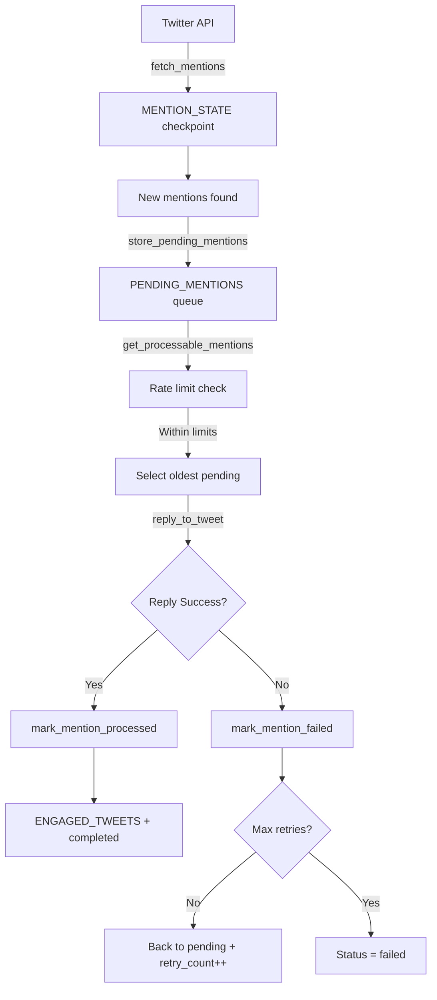

# 🗄️ GlitchBot Database Schema & Operations

This document provides comprehensive documentation for GlitchBot's SQLite database, including schema design, table relationships, and operational procedures for the complete context-aware mention processing system.

## 📊 **Database Overview**

**File:** `glitchbot.db` (SQLite)  
**Location:** Project root directory  
**Purpose:** Persistent storage for context-aware mentions queue, suggested tweet curation, rate limiting, engagement tracking, and system state  
**Architecture:** Centralized DatabaseManager with enhanced mention-to-content linkage system

### **🎯 Core Innovation: Mention→Content Linkage**

The database now features a sophisticated linkage system between `PENDING_MENTIONS` and `SUGGESTED_TWEETS` via the `discovered_via_mention_id` field, enabling intelligent context-aware responses.

## 🏗️ **Database Architecture**

### **Centralized Initialization System**

GlitchBot uses a **centralized DatabaseManager** for all schema creation and management:

```typescript
// src/lib/database-manager.ts
export class DatabaseManager {
  private initialize(): void {
    this.createCoreSchema(); // mention_state, cadence
    this.createQueueSchema(); // pending_mentions
    this.createRateLimitSchema(); // rate_limits
    this.createEngagementSchema(); // engaged_tweets
    this.createIndexes(); // All performance indexes
  }
}
```

**Key Benefits:**

- **Single Source of Truth**: All 5 tables created in one place
- **Dependency Injection**: Clean architecture with explicit database passing
- **Clear Initialization Order**: Logical schema creation sequence
- **Maintainable**: Easy to see complete database structure

**Usage Pattern:**

```typescript
// Main application
const dbManager = new DatabaseManager();
const db = new GlitchBotDB(dbManager);
const rateLimiter = new GlobalRateLimiter(dbManager);
```

## 🏗️ **Table Schema**

### **1. PENDING_MENTIONS - Core Queue System**

**Purpose:** Stores all fetched mentions in a persistent queue for processing

```sql
CREATE TABLE pending_mentions (
  mention_id TEXT PRIMARY KEY,              -- Twitter tweet ID
  author_id TEXT NOT NULL,                  -- Twitter user ID
  author_username TEXT NOT NULL,            -- Twitter username (e.g., "whoHambo")
  text TEXT NOT NULL,                       -- Full tweet text content
  created_at TEXT NOT NULL,                 -- Tweet creation timestamp (ISO)
  fetched_at TIMESTAMP DEFAULT CURRENT_TIMESTAMP,  -- When we discovered it
  processed_at TIMESTAMP,                   -- When successfully processed (NULL = pending)
  status TEXT DEFAULT 'pending' CHECK(status IN ('pending','processing','completed','failed')),
  priority INTEGER DEFAULT 5,               -- Priority 1-10 (lower = higher priority)
  retry_count INTEGER DEFAULT 0,            -- Number of failed attempts
  last_error TEXT,                          -- Last error message for debugging
  intent_type TEXT,                         -- Detected intent (future: 'question', 'suggestion', etc.)
  confidence REAL,                          -- Intent confidence score (future use)
  original_fetch_id TEXT,                   -- Batch ID from fetch operation
  worker_id TEXT,                           -- Which worker is processing (NULL = available)
  referenced_tweets TEXT                    -- JSON array of referenced tweet data
);

-- Indexes for performance
CREATE INDEX idx_pending_status_priority ON pending_mentions(status, priority, created_at);
CREATE INDEX idx_pending_author ON pending_mentions(author_id);
```

**Status Flow:**

- `pending` → `processing` → `completed` (success)
- `pending` → `processing` → `pending` (retry after failure)
- `pending` → `processing` → `failed` (max retries exceeded)

### **2. MENTION_STATE - Checkpoint Tracking**

**Purpose:** Tracks API checkpoint to prevent duplicate fetches and missed mentions

```sql
CREATE TABLE mention_state (
  key TEXT PRIMARY KEY,                     -- State key ('last_since_id', 'last_fetch_time')
  value TEXT,                               -- State value (tweet ID or timestamp)
  updated_at TIMESTAMP DEFAULT CURRENT_TIMESTAMP  -- Last update time
);
```

**Key Records:**

- `last_since_id`: Latest mention ID processed (Twitter pagination)
- `last_fetch_time`: Timestamp of last successful fetch operation

### **3. SUGGESTED_TWEETS - Content Curation System**

**Purpose:** Stores curated content referenced in mentions for intelligent response context

```sql
CREATE TABLE suggested_tweets (
  tweet_id TEXT PRIMARY KEY,               -- Referenced tweet ID
  author_id TEXT NOT NULL,                 -- Original tweet author ID
  author_username TEXT NOT NULL,           -- Original tweet author username
  content TEXT NOT NULL,                   -- Tweet content/text
  created_at TEXT NOT NULL,                -- Original tweet timestamp
  public_metrics TEXT,                     -- JSON: engagement metrics (likes, retweets, etc.)
  discovered_via_mention_id TEXT NOT NULL, -- Links to pending_mentions.mention_id
  discovery_timestamp TIMESTAMP DEFAULT CURRENT_TIMESTAMP, -- When we discovered it
  curation_score REAL DEFAULT 0            -- Content quality score (7 = actively shared)
);

-- Critical index for mention→content linkage
CREATE INDEX idx_candidate_discovered_via ON suggested_tweets(discovered_via_mention_id);
CREATE INDEX idx_candidate_score ON suggested_tweets(curation_score DESC);
```

**🔗 Key Innovation: Mention→Content Linkage**

The `discovered_via_mention_id` field creates a direct link between mentions and the content users are sharing:

- When user posts: `@glitchbot_ai check this out!` + references @sama's tweet
- `pending_mentions` stores the mention with `mention_id = "123"`
- `suggested_tweets` stores @sama's tweet with `discovered_via_mention_id = "123"`
- Worker retrieves mention with context: "User shared @sama's AI research paper"
- Response: "Fascinating research from @sama! Thanks for flagging this @user 🤖"

### **4. ENGAGEMENT TRACKING - Duplicate Prevention**

**Purpose:** Records bot interactions to prevent duplicates (replies and quotes)

```sql
-- Replies and likes
CREATE TABLE engaged_mentions (
  mention_id TEXT PRIMARY KEY,
  engaged_at TIMESTAMP DEFAULT CURRENT_TIMESTAMP,
  action TEXT CHECK(action IN ('reply','like')) NOT NULL
);

-- Quotes
CREATE TABLE engaged_quotes (
  tweet_id TEXT PRIMARY KEY,
  engaged_at TIMESTAMP DEFAULT CURRENT_TIMESTAMP,
  action TEXT DEFAULT 'quote' NOT NULL
);

CREATE INDEX idx_engaged_mentions_at ON engaged_mentions(engaged_at);
CREATE INDEX idx_engaged_quotes_at ON engaged_quotes(engaged_at);
```

### **5. RATE_LIMITS - API Protection**

**Purpose:** Tracks Twitter API usage across multiple time windows and workers

```sql
CREATE TABLE rate_limits (
  endpoint TEXT NOT NULL,                   -- API endpoint ('fetch_mentions', 'reply_tweet', etc.)
  window_type TEXT NOT NULL,                -- Time window ('per_15min', 'per_hour', 'per_day')
  window_start INTEGER NOT NULL,           -- Window start timestamp (Unix)
  requests_used INTEGER DEFAULT 0,         -- Requests consumed in this window
  worker_usage TEXT DEFAULT '{}',          -- JSON: per-worker usage tracking
  twitter_reset_time INTEGER,              -- Twitter's actual reset time (from headers)
  PRIMARY KEY (endpoint, window_type, window_start)
);

-- Indexes for efficient lookups
CREATE INDEX idx_rate_limits_window ON rate_limits(endpoint, window_type, window_start);
CREATE INDEX idx_rate_limits_reset ON rate_limits(twitter_reset_time);
```

### **6. CADENCE - Timing Rules**

**Purpose:** Enforces posting cadence and timing rules (Step 1.3+)

```sql
CREATE TABLE cadence (
  key TEXT PRIMARY KEY,                     -- Rule key ('last_quote_time', 'sleep_window_start')
  value TEXT                                -- Rule value (timestamp or setting)
);
```

Used for quote/reply cadence tracking. Current guards: 1 hour between quotes; 60 seconds between replies.

### **7. TIMELINE_STATE - Timeline Pagination**

```sql
CREATE TABLE timeline_state (
  key TEXT PRIMARY KEY,
  value TEXT,
  updated_at TIMESTAMP DEFAULT CURRENT_TIMESTAMP
);
```

Used by `get_timeline` to manage newest_id and pagination token.

## 🔄 **Queue System Operations**

### **Mention Processing Flow**



### **Core GameFunctions**

1. **`store_pending_mentions`** - Add fetched mentions to queue
2. **`get_processable_mentions`** - Get rate-limit-aware batch for processing
3. **`mark_mention_processed`** - Mark successful completion
4. **`mark_mention_failed`** - Handle failures with retry logic
5. **`update_mention_checkpoint`** - Update since_id after successful fetch

## 📊 **Monitoring Queries**

### **Queue Status Overview**

```sql
SELECT
  status,
  COUNT(*) as count,
  AVG(priority) as avg_priority,
  MIN(created_at) as oldest,
  MAX(created_at) as newest
FROM pending_mentions
GROUP BY status;
```

### **Recent Activity**

```sql
SELECT
  author_username,
  mention_id,
  status,
  processed_at,
  retry_count
FROM pending_mentions
WHERE processed_at IS NOT NULL
ORDER BY processed_at DESC
LIMIT 10;
```

### **Error Analysis**

```sql
SELECT
  last_error,
  COUNT(*) as occurrences,
  GROUP_CONCAT(author_username) as affected_users
FROM pending_mentions
WHERE last_error IS NOT NULL
GROUP BY last_error
ORDER BY occurrences DESC;
```

### **Rate Limit Status**

```sql
SELECT
  endpoint,
  window_type,
  requests_used,
  datetime(window_start, 'unixepoch') as window_start_time
FROM rate_limits
WHERE datetime(window_start, 'unixepoch') > datetime('now', '-1 hour')
ORDER BY endpoint, window_type;
```

## 🚨 **Operational Procedures**

### **Daily Maintenance**

- Run `npm run db:inspect` to check overall health
- Monitor queue size and completion rates
- Check for stuck mentions (status='processing' > 1 hour)
- Review error patterns in `last_error` field

### **Troubleshooting**

**Stuck Mentions:**

```sql
-- Find mentions stuck in processing
SELECT * FROM pending_mentions
WHERE status = 'processing'
  AND updated_at < datetime('now', '-1 hour');

-- Reset stuck mentions to pending
UPDATE pending_mentions
SET status = 'pending', worker_id = NULL
WHERE status = 'processing'
  AND updated_at < datetime('now', '-1 hour');
```

**Rate Limit Issues:**

```sql
-- Clear rate limits (TESTING ONLY)
DELETE FROM rate_limits;
```

**Queue Backlog:**

```sql
-- Check queue depth by age
SELECT
  DATE(created_at) as date,
  COUNT(*) as mentions,
  SUM(CASE WHEN status = 'pending' THEN 1 ELSE 0 END) as pending
FROM pending_mentions
GROUP BY DATE(created_at)
ORDER BY date DESC;
```

## 🔧 **Backup & Recovery**

### **Backup Database**

```bash
# Create timestamped backup
cp glitchbot.db "backups/glitchbot_$(date +%Y%m%d_%H%M%S).db"

# Or using npm script (future)
npm run db:backup
```

### **Restore Database**

```bash
# Restore from backup
cp backups/glitchbot_YYYYMMDD_HHMMSS.db glitchbot.db
```

### **Data Export**

```bash
# Export to SQL
sqlite3 glitchbot.db .dump > glitchbot_backup.sql

# Import from SQL
sqlite3 glitchbot_new.db < glitchbot_backup.sql
```

## 📈 **Performance Considerations**

### **Index Usage**

- `idx_pending_status_priority`: Optimizes queue selection queries
- `idx_pending_author`: Fast author-based lookups
- `idx_engaged_at`: Efficient duplicate checking
- `idx_rate_limits_window`: Fast rate limit lookups

### **Cleanup Operations**

```sql
-- Remove old engaged tweets (>30 days)
DELETE FROM engaged_tweets
WHERE engaged_at < datetime('now', '-30 days');

-- Remove old rate limit records (>7 days)
DELETE FROM rate_limits
WHERE datetime(window_start, 'unixepoch') < datetime('now', '-7 days');

-- Archive old completed mentions (>90 days)
INSERT INTO archived_mentions SELECT * FROM pending_mentions
WHERE status = 'completed' AND processed_at < datetime('now', '-90 days');

DELETE FROM pending_mentions
WHERE status = 'completed' AND processed_at < datetime('now', '-90 days');
```

## 🚀 **Schema Evolution**

### **Version 1.2 (Current) - Database Centralization Complete ✅**

- ✅ Basic queue system with retry logic
- ✅ Rate limiting and engagement tracking
- ✅ Enhanced error logging
- ✅ **Centralized DatabaseManager** - Single initialization point
- ✅ **Dependency Injection** - Clean architecture patterns
- ✅ **Enterprise-Grade Structure** - Maintainable schema management

### **Future Enhancements (Step 1.3+)**

- 🔄 Intent classification fields
- 🔄 Conversation context tracking
- 🔄 Advanced priority algorithms
- 🔄 Analytics and performance metrics
- 🔄 Schema migration system with versioning

## 🔍 **Monitoring Scripts**

- **`npm run db:inspect`** - Complete database overview
- **`npm run queue:status`** - Quick queue status check
- **`npm run db:reset`** - Reset to fresh state (development only)

This schema provides a robust foundation for GlitchBot's queue-based mention processing system with enterprise-grade error handling and monitoring capabilities.

## 📖 **Related Documentation**

- **[Database Centralization Proposal](./database-centralization-proposal.md)** - Implementation details and architecture decisions for the centralized database system
- **[Implementation Guide](./implementation-guide.md)** - Complete development roadmap including database milestones
- **[Documentation Index](./README.md)** - Navigation hub for all project documentation
